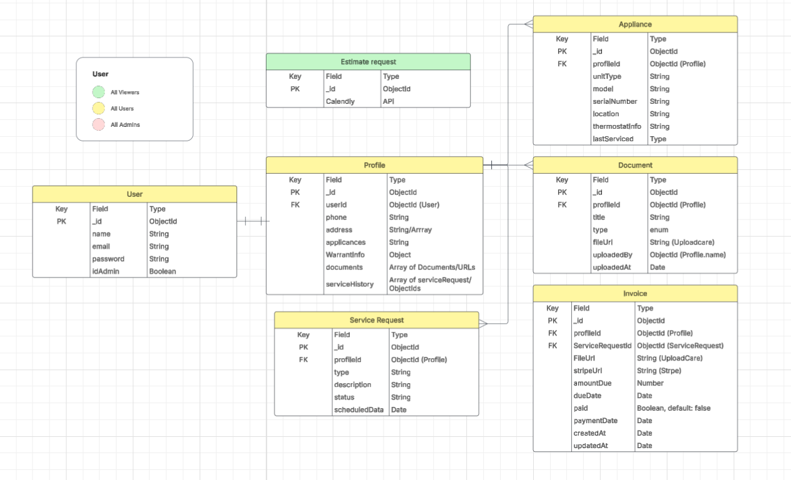
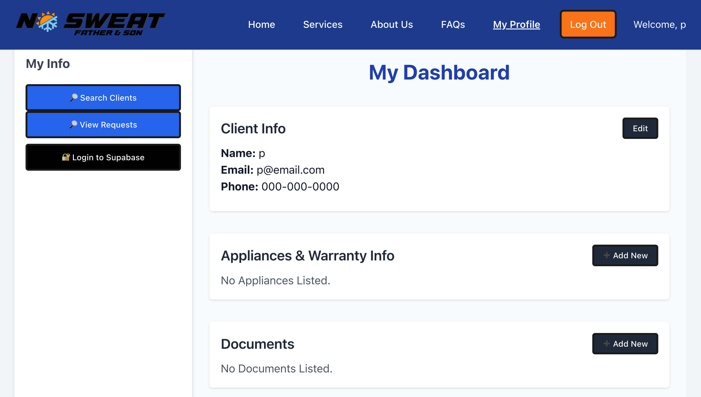

# No Sweat: HVAC Service Management App

A full-stack HVAC service management platform designed for clients and technicians to stay connected, manage documents, and schedule services.

---

## App Overview

**No Sweat: Father & Son** is a responsive HVAC service management platform that allows homeowners to manage service requests, upload appliance info and documents, and access their warranties and invoices. Admins can search clients, upload files, manage service history, and access internal tools.

This MERN (MongoDB, Express, React, Node.js) stack application was built to streamline the chaotic paper trail often involved in home HVAC service, helping companies and clients alike stay organized and informed.

---

## Getting Started

### Deployed App  
**[Click to Visit](https://nosweatfns-9a1391929de6.herokuapp.com/)**

### Planning Materials

- Wireframes & User Flows

- Entity Relationship Diagram

---

## Technologies Used

### Front-End
- React  
- React Router  
- Tailwind CSS  
- Lucide Icons  
- SupaBase 
- Stripe API (payment integration)  
- Calendly (embedded appointment scheduling)

### Back-End
- Node.js  
- Express  
- MongoDB + Mongoose  
- JWT Authentication  
- SupaBase SDK  
- Stripe SDK  

---

## Screenshot

---

## Features
- JWT-based user authentication  
- Role-based access control (client/admin)  
- Profile dashboard with editable client info  
- Upload appliance & warranty documents  
- View, search, and manage service history  
- Create and edit service requests  
- Admin Tools Panel with user search  
- Embedded appointment scheduler (Calendly)  

---

## Attributions
- [Supabase](https://supabase.com) – File storage & management  
- [Stripe](https://stripe.com) – Payment handling  (pending)
- [Lucide Icons](https://lucide.dev) – Iconography  
- [Calendly](https://calendly.com) – Scheduling tool (pending)

---

## Next Steps
- Add SMS/email reminders for service dates  
- Integrate push notifications for documents/invoice uploads  
- Expand Admin panel to include analytics dashboards  
- Allow users to pay directly from invoice document  
- Client reviews and feedback collection post-service  

